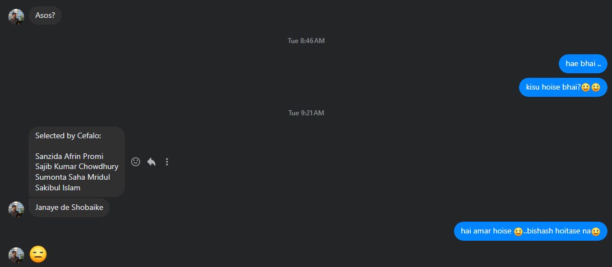

### 🔖 Internship Recruitment Process : Cefalo Bangladesh Ltd

As Internship Recruitment Process, I have applied for the Cefalo Bangladesh Ltd Internship. So My Teacher dropped my CV to Cefalo Bangladesh Ltd on 25/06/2024. After that, I got a call from Cefalo Bangladesh Ltd for the Internship Recruitment Process on 05-07-2024.
The recruitment process consisted of 3 phases :

### 🖖 Recuriement Phase - 1 : Behavioral Interview (Time : 08.07.2024  3.00 PM)

This was a behavioral interview with the MD of Cefalo Bangladesh Ltd. The Interview was scheduled for 30mins.He asked me several questions : 

- Whole Interview was in **English Language**
- Introduction About Yourself
- Why choose software engineering?
- What's reason you like coding?
- Talk about family? Who's the earning member currently Now?
- Tell me about cefalo? (What and How did you know about cefalo)?
- What's your hobbies? What you normally do in free time?
- What's your future plan? Which role you like to see yourself?
- What's your CGPA? What's your rank in your batch?
- Any plan for becoming? rank 1?
- Do have any question for me ? Otherwise we will move hackerrank Coding?

### 👨‍💻 Recuriement Phase - 2 : Technical + Coding Test (Time : 08.07.2024  4.00 PM)

This was a coding test on HackerRank. The test was 1.5 hour long and consisted of 12 questions. I had to open my camera all the time and monitoring checking access about my activitis in my laptop. The questions were :

1. Java OOP : 8 questions (All are MCQ Questions)
    - Question can have multiple correct answers
    - Same Function Name and Argument Type but Different Implementation : which OOP Concept?
    - Code On Nested Inheritance and abstraction : What's output?
    - Code on Using Both extends and implements : What's output?
    - More Questions on OOP Principle (Encapsulation, Inheritance, Polymorphism)
    - Code on Interface and Abstract Class : What's output?

2. SQL : 2 questions (All are MCQ Questions)
    - Questions on SQL Joins(Self Join Code)
    - Questions on Delete a column from a table

3. Coding + Problem Solving : 2 CP questions (Write Code and Pass All Test Cases)

> **Question - 1: Find Valid Words in a String**

A word is valid if it contains only alphabets/ Numerical Value. But the word will be only valid if it contains at least one vowel and one consonant alphabets value. Write a function that takes a string as input and returns the number of valid words in the string.

> **Question - 2: Find Range of Valid Ip Address**

You are given some ip addresss and table of range of ip address. You have to find the range of valid ip address. Write a function that takes a string as input and returns the range of valid ip address. Also check this ip address is valid or not (Follows Ip Address Value : each octet <= 255).

### 🏆 Recuriement Phase - 3 : Result (Time : 16.07.2024  8.00 AM)

After 7 days, Cefalo Bangladesh Ltd, Hr informed My Teacher who dropped My CV to Cefalo Bangladesh Ltd that I got selected for the Cefalo Bangladesh Ltd Internship.

